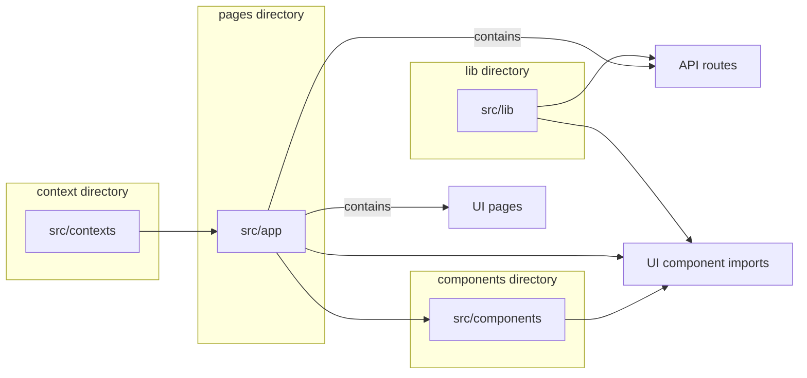
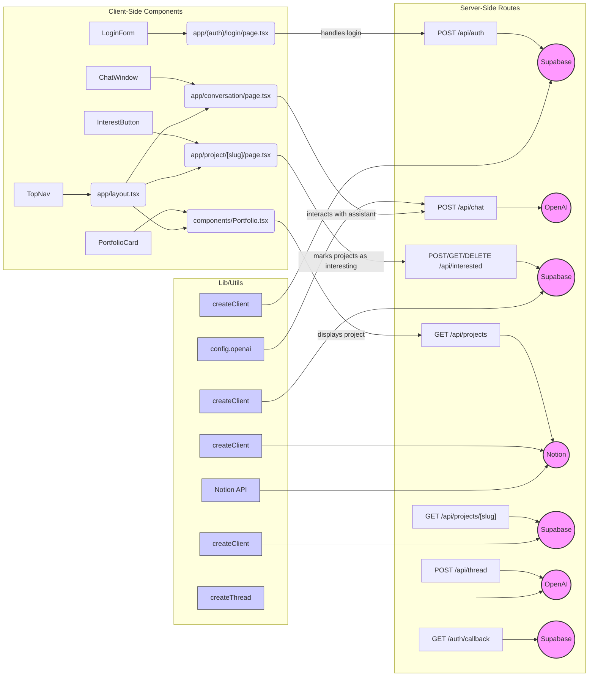

# Portfolio25 - PRD v3.1

## **1. Executive Summary**

**Project:** Chat-Based Portfolio with GPT Integration & Notion CMS

**Version:** v3.1

**Date:** 05/Feb/2025

**Author:** Marc Muller / DataInvest.guru

### **Overview**

Portfolio25 represents a sophisticated **Next.js (v14)** application meticulously crafted to deliver a dynamic professional portfolio experience. At its core, the platform seamlessly integrates with **Notion** for content management, leverages advanced **GPT-driven chat interactions** for engaging user experiences, and incorporates an intuitive **project interest tracking system** that enables visitors to bookmark and follow projects that capture their attention. This modern web application combines cutting-edge technology with user-centric design to create a portfolio platform that's both powerful and accessible.

### **Key Features**

- **Supabase Authentication**: Simple, passwordless login system.
- **Conversational UI**: Interactive chat interface for onboarding and project discovery, powered by **GPT-4 Turbo**.
- **Thread-based AI Memory**: Smart conversation tracking for personalized experiences.
- **Notion CMS Integration**: Real-time portfolio content management.
- **Interest Tracking**: Save and reference favorite projects.
- **Protected Routes & Middleware**: Enhanced security for user data.
- **Enhanced UI/UX**: Smooth animations with **Framer Motion**.
- **Analytics Dashboard**: Comprehensive user engagement metrics.

### **Tech Stack**

- **Next.js (v14)**
- **Supabase** (Auth + Database)
- **OpenAI API** (GPT-powered chat)
- **Notion API** (Portfolio data)
- **TailwindCSS** (Styling)
- **ShadCN/UI & Framer Motion** (UI components & animations)

## **2. Application Architecture & Folder Structure**




### **2.1 Folder Structure**

📂 datainvest23-my-portfolio25/
├── 📂 components/            # UI Components
│   ├── Layout.tsx           # Page Layout
│   ├── ChatWindow.tsx       # GPT Chat Interface
│   ├── PortfolioCard.tsx    # Portfolio Project Card
│   ├── Sidebar.tsx          # Sidebar Navigation
│   ├── InterestButton.tsx   # "Interested" button component
│   └── ui/                  # Custom UI elements (buttons, inputs, etc.)
├── 📂 src/
│   ├── 📂 app/
│   │   ├── page.tsx         # Home page
│   │   ├── layout.tsx       # Main Layout
│   │   ├── (auth)/          # Authentication pages
│   │   │   ├── login/page.tsx    # Login page
│   │   │   ├── callback/route.ts # Authentication callback
│   │   ├── portfolio/[id]/page.tsx  # Portfolio project details
│   │   ├── interested/page.tsx     # User's interested projects
│   │   ├── conversation/page.tsx   # AI Chat interaction
│   │   ├── api/
│   │   │   ├── gpt/message/route.ts  # GPT Message API
│   │   │   ├── gpt/thread/route.ts   # GPT Thread API
│   │   │   ├── notion/project/[id]/route.ts  # Notion Project Fetch API
│   │   │   ├── interested/route.ts   # Interest tracking API
│   │   │   ├── auth/callback/route.ts # Supabase Auth Callback
│   │   ├── middleware.ts       # API security middleware
│   ├── 📂 lib/
│   │   ├── notion.ts         # Notion API helpers
│   │   ├── openai.ts         # OpenAI API handlers
│   │   ├── supabaseClient.ts # Supabase client setup
│   │   ├── utils.ts          # General utility functions
│   ├── 📂 providers/
│   │   ├── SupabaseProvider.tsx  # Supabase Auth Provider
│   │   ├── ToastProvider.tsx     # Toast Notifications
│   ├── 📂 services/
│   │   ├── notion/getProjects.ts  # Fetches portfolio projects
│   ├── 📂 types/
│   │   ├── api.ts         # API response types
│   │   ├── notion.ts      # Notion types
│   │   ├── openai.ts      # GPT types
│   │   ├── supabase.ts    # Supabase types
├── [README.md](http://readme.md/)
├── package.json
├── next.config.js
└── tailwind.config.js

## **3. API Endpoints**



### **3.1 GPT Chat API**

**Endpoint:** `POST /api/gpt/message/`

- Handles user messages and returns AI-generated responses.
- Retains conversation **thread ID** for memory.

**Example Request:**

```
{
  "threadId": "abc123",
  "message": "Tell me about your projects."
}
```

**Example Response:**

```
{
  "response": "Sure! Here are some of my projects..."
}
```

---

### **3.2 Notion Portfolio API**

**Endpoint:** `GET /api/notion/project/[id]`

- **Description:** Fetches a single project from the Supabase table using its slug. This provides detailed information about a specific project.
- **Purpose:** Enables the display of detailed project information on the project detail page (src/app/project/[slug]/page.tsx).
- **Request:**
    - *Method:* GET
    - *URL:* /api/projects/[slug] (where [slug] is the unique identifier for the project)
    - *Headers:* None
- **Response:**
    - *Success (200 OK):*
        
        ```tsx
        {
            "id": "abc123",
            "title": "Next.js AI Portfolio",
            "description": "An AI-enhanced portfolio using Next.js, Notion, and OpenAI.",
            "shortDescription": "Example",
            "imageUrl": "https://example.com/image.jpg",
            "status": "Published",
            "type": "Example",
            "tags": [],
            "aiKeywords": [],
            "slug": "nextjs-ai-portfolio",
            "created_at": "2024-01-01T00:00:00.000Z",
            "updated_at": "2024-01-01T00:00:00.000Z"
        }
        ```
        
    - *Error Responses:*
        - *404 Not Found:* Occurs if the project with the specified id does not exist.
            
            ```tsx
            { "error": "Project not found" }
            ```
            
        - *500 Internal Server Error:* Occurs if there's an issue with the server or database connection.
            
            ```tsx
            { "error": "Internal Server Error" }
            ```
            
            **content_copydownload**Use code [**with caution**](https://support.google.com/legal/answer/13505487).Json
            
- **Error Handling:**
    - Handles errors related to project not found, database connection issues, and other internal errors.
    - Returns appropriate HTTP status codes and error messages.
- **Implementation Details:**
    - The API route retrieves the id from the URL parameters.
    - It queries the Supabase projects table for a project with the matching id.
    - If a project is found, it is returned in the response. Otherwise, a 404 error is returned.
- **Code Snippet (src/app/api/projects/[slug]/route.ts):**
    
    ```tsx
    // src/app/api/projects/[slug]/route.ts
    import { createClient } from '@/utils/supabase/server';
    import { NextResponse } from 'next/server';
    
    export async function GET(
      request: Request,
      { params }: { params: { slug: string } }
    ) {
      try {
        const supabase = await createClient();
        const { data: project, error } = await supabase
          .from('projects')
          .select('*')
          .eq('slug', params.slug)
          .single();
    
        if (error || !project) {
          return new NextResponse('Project not found', { status: 404 });
        }
    
        return NextResponse.json(project);
      } catch (error) {
        console.error('Error:', error);
        return new NextResponse('Internal Error', { status: 500 });
      }
    }
    ```
    

---

### **3.3 Interested Projects API**

**Endpoint:** `POST /api/interested/`

- **Description:** Allows authenticated users to save projects they find interesting. It creates a record linking the user to a specific project.
- **Purpose:** Enables users to curate a list of projects they want to follow up on or revisit later.
- **Request:**
    - *Method:* POST
    - *URL:* /api/interested
    - *Headers:* Content-Type: application/json
    - *Body:*
        
        ```tsx
        {
          "portfolio_item_id": "string", // The ID of the Notion project item (required)
          "project_name": "string",
          "image_url": "string",
          "project_details": {
                   "shortDescription":"string",
                     "type":"string",
                    "tags":[]
                 },
        }
        ```
        
    - *Example Request:*
        
        ```tsx
        {
          "portfolio_item_id": "abc123",
            "project_name":"Portfolio Project",
             "image_url":"image.com",
                "project_details":{
                   "shortDescription":"amazing project",
                     "type":"awesome",
                    "tags":[]
                 },
        }
        ```
        
- **Response:**
    - *Success (200 OK):*
        
        `{ "success": true }`
        
    - *Error Responses:*
        - *400 Bad Request:* Occurs if projectId is missing in the request body.
            
            `{ "error": "projectId is missing" }`
            
        - *401 Unauthorized:* Occurs if the user is not authenticated.
            
            `{ "error": "Unauthorized" }`
            
        - *500 Internal Server Error:* Occurs if there's an issue with the database or server-side processing.
            
            `{ "error": "Internal Server Error" }`
            
- **Error Handling:**
    - Handles errors related to missing parameters, unauthorized access, and database issues.
    - Returns appropriate HTTP status codes and error messages.
- **Implementation Details:**
    - The API route retrieves the projectId from the request body.
    - It verifies that the user is authenticated.
    - It creates a new record in the Supabase user_interests table, linking the user to the project.
    
    ```tsx
    Example:* ```typescript // src/app/interested/page.tsx <InterestedButton onClick={() => removeItem(item.id, item.project_name)} className="opacity-0 group-hover:opacity-100 transition-opacity p-2 text-gray-400 hover:text-red-500 rounded-full hover:bg-red-50 focus:outline-none focus:ring-2 focus:ring-red-500 focus:ring-offset-2" title="Remove from interested" > <XCircleIcon className="w-6 h-6" /> </button> ```
    ```
    
- **Code Snippet (src/app/api/interested/route.ts):**
    
    ```tsx
    // src/app/api/interested/route.ts
    import { NextRequest, NextResponse } from 'next/server';
    import { createClient } from '@/utils/supabase/server';
    
    export async function POST(req: NextRequest) {
      try {
        const supabase = await createClient();
        const { data: { session } } = await supabase.auth.getSession();
    
        if (!session?.user) {
          return NextResponse.json({ error: 'Unauthorized' }, { status: 401 });
        }
    
        const { projectId } = await req.json();
    
        if (!projectId) {
          return NextResponse.json({ error: 'projectId is missing' }, { status: 400 });
        }
    
        // Insert into the database
        //... Implementation
        return NextResponse.json({ success: true }, { status: 200 });
    
      } catch (error) {
        console.error('Error in POST /api/interested:', error);
        return NextResponse.json(
          { error: 'Internal Server Error' },
          { status: 500 }
        );
      }
    }
    ```
    

---

## **4. Authentication & Security**

This section details the authentication mechanisms and security considerations for the Portfolio25 application.

### **4.1 Supabase Authentication**

- **Passwordless Login via Supabase Auth:**
    - The application implements a passwordless authentication flow using Supabase Auth. This enhances security by eliminating the risk associated with password storage and management.
    - *Implementation Details:*
        - Users initiate the login process by entering their email address.
        - Supabase sends a magic link to the provided email address.
        - Clicking the magic link directs the user to a callback URL within the application.
        - Supabase then exchanges the code for a session, authenticating the user.
    - *Code Snippet (app/(auth)/login/page.tsx):*
        
        ```tsx
        // src/app/(auth)/login/page.tsx
        import { createClient } from '@/utils/supabase/client';
        const supabase = createClient();
        const [email, setEmail] = useState('');
        
        const handleLogin = async () => {
          const { error } = await supabase.auth.signInWithOtp({
            email,
            options: {
              emailRedirectTo: `${window.location.origin}/auth/callback`,
            },
          });
        
          if (error) {
            // Handle error (e.g., display error message)
          } else {
            // Display success message (e.g., "Check your email for the magic link!")
          }
        };
        ```
        
- **Session Management:**
    - The application uses middleware to check supabase.auth.getSession() on protected routes. This ensures that users have a valid session before accessing sensitive data or functionality.
    - *Implementation Details:*
        - The middleware function intercepts requests to protected routes.
        - It calls supabase.auth.getSession() to retrieve the user's session from the cookies.
        - If no session is found, the user is redirected to the login page.
        - If a session is found, the request is allowed to proceed.
    - *Code Snippet (src/middleware.ts):*
        
        ```tsx
        // src/middleware.ts
        import { createMiddlewareClient } from '@supabase/auth-helpers-nextjs';
        import { NextResponse } from 'next/server';
        import type { NextRequest } from 'next/server';
        
        export async function middleware(req: NextRequest) {
          const res = NextResponse.next();
          const supabase = createMiddlewareClient({ req, res });
        
          const { data: { session } } = await supabase.auth.getSession();
        
          if (!session && !req.nextUrl.pathname.startsWith('/login')) {
            return NextResponse.redirect(new URL('/login', req.url));
          }
        
          return res;
        }
        
        export const config = {
          matcher: ['/', '/interested', '/conversation'],
        };
        ```
        
- **JWT Token Handling:**
    - Supabase's authentication system uses JSON Web Tokens (JWTs) to securely manage user sessions.
    - *Implementation Details:*
        - Supabase automatically handles the storage and validation of JWTs in cookies.
        - The supabase.auth.getSession() function retrieves the JWT from the cookies and verifies its validity.
        - Supabase provides automatic refresh token rotation to enhance security and prevent unauthorized access.

### **4.2 API Middleware Security**

- **Session Required:**
    - Protected API endpoints verify user authentication through a comprehensive middleware layer. This ensures that only authenticated users can access sensitive resources.
    - *Implementation Details:*
        - API routes such as /api/chat and /api/interested are protected by the middleware.
        - The middleware checks for a valid user session using supabase.auth.getSession().
        - If no session is found, the API returns a 401 Unauthorized error.
    - *Code Snippet (src/middleware.ts):*
        
        ```tsx
        // src/middleware.ts (API Route Protection)
        import { createMiddlewareClient } from '@supabase/auth-helpers-nextjs';
        import { NextResponse } from 'next/server';
        import type { NextRequest } from 'next/server';
        
        export async function middleware(req: NextRequest) {
          const res = NextResponse.next();
          const supabase = createMiddlewareClient({ req, res });
        
          const { data: { session } } = await supabase.auth.getSession();
        
          if (!session) {
            return NextResponse.json({ error: 'Unauthorized' }, { status: 401 });
          }
        
          return res;
        }
        
        export const config = {
          matcher: ['/api/chat', '/api/interested'], // Protect API Routes
        };
        ```
        
- **CORS Protection:**
    - The application implements Cross-Origin Resource Sharing (CORS) policies to prevent unauthorized API access from external domains.
    - *Implementation Details:*
        - Next.js handles CORS configuration automatically. The default configuration only allows requests from the same origin. To allow requests from other origins, you would need to configure custom headers (e.g., using next.config.js).
        - For example, you can configure CORS headers to allow requests from specific domains:
    - *Code Snippet (next.config.js):*
        
        ```tsx
        // next.config.js
        /** @type {import('next').NextConfig} */
        const nextConfig = {
          async headers() {
            return [
              {
                source: '/api/:path*',
                headers: [
                  { key: 'Access-Control-Allow-Credentials', value: 'true' },
                  { key: 'Access-Control-Allow-Origin', value: 'https://example.com' }, // Change to your allowed origin
                  { key: 'Access-Control-Allow-Methods', value: 'GET,DELETE,PATCH,POST,PUT' },
                  { key: 'Access-Control-Allow-Headers', value: 'X-CSRF-Token, X-Requested-With, Accept, Accept-Version, Content-Length, Content-MD5, Content-Type, Date, X-Api-Version' },
                ],
              },
            ];
          },
        };
        
        module.exports = nextConfig;
        ```
        
- **Rate Limiting (Planned):**
    - To be implemented for /api/gpt/message/ with configurable thresholds based on user roles and subscription levels.
    - *Implementation Details:*
        - We will use a middleware to track the number of requests made by each user or IP address within a specific time window.
        - If a user exceeds the allowed request limit, the middleware will return a 429 Too Many Requests error.
        - The limits can be configured based on user roles or subscription levels.

**5. Future Enhancements**

- **Rate Limiting Middleware:**
    - Implement request throttling to protect against abuse and DoS attacks.
    - *Details:*
        - Use a memory-based or Redis store to track request counts.
        - Implement a sliding window algorithm for accurate rate limiting.
        - Allow configuration of request limits per user, IP address, or route.
    - *Example Code (Conceptual):*
        
        ```tsx
        // src/middleware/rateLimit.ts (Conceptual)
        import { NextResponse } from 'next/server';
        
        const rateLimit = async (req, res, limit = 10, timeWindow = 60) => {
          const ip = req.headers.get('x-real-ip') || req.ip;
        
          // Implement Redis connection here
          // const redis = new Redis(process.env.REDIS_URL);
        
          const key = `rateLimit:${ip}`;
          const count = await redis.incr(key);
        
          let ttl = timeWindow;
          if (count === 1) {
            await redis.expire(key, timeWindow);
          } else {
            ttl = await redis.ttl(key);
          }
        
          if (count > limit) {
            return new NextResponse(JSON.stringify({ error: 'Rate limited' }), { status: 429 });
          }
        
          // Set Headers
          res.headers.set('X-RateLimit-Limit', limit.toString());
          res.headers.set('X-RateLimit-Remaining', Math.max(0, limit - count).toString());
          res.headers.set('X-RateLimit-Reset', ttl.toString());
          res.setHeader('X-RateLimit-Limit', limit.toString());
          res.setHeader('X-RateLimit-Remaining', Math.max(0, limit - count).toString());
          res.setHeader('X-RateLimit-Reset', ttl.toString());
        };
        ```
        
- **Caching:**
    - Optimize Notion API calls using Incremental Static Regeneration (ISR) or Redis.
    - *Details:*
        - ISR allows Next.js to revalidate static content in the background, improving performance while keeping data fresh.
        - Redis can be used to cache API responses and frequently accessed data.
    - *Example Code (ISR in src/app/api/projects/route.ts):*
        
        ```tsx
        // src/app/api/projects/route.ts
        export const revalidate = 60; // Revalidate every 60 seconds
        ```
        
- **OpenAPI Documentation:**
    - Provide a Swagger UI for a detailed API reference.
    - *Details:*
        - Use a library like nextjs-swagger-doc to generate OpenAPI definitions from Next.js API routes.
        - Deploy Swagger UI to visualize and interact with the API.
    - *Example Implementation (Conceptual):*
        1. Install nextjs-swagger-doc.
        2. Configure a route to generate the Swagger JSON.
        3. Set up Swagger UI to consume the JSON definition.
- **Expanded GPT Features:**
    - Implement long-term conversation storage and personalization.
    - *Details:*
        - Store chat logs in a database (e.g., Supabase).
        - Use the chat history to personalize assistant responses.
        - Allow users to manage and review their past conversations.

## **6. Deployment & Hosting**

- **Deployed on Vercel:**
    - Leverage Vercel's edge network for optimal global performance and automated scaling capabilities.
    - *Implementation Details:*
        - Automated builds and deployments upon code changes on the main branch.
        - Vercel's serverless functions handle API requests and dynamic content rendering.
- **Environment Variables Managed via Vercel UI:**
    - Secure configuration management with separate development and production environment settings, ensuring sensitive credentials remain protected.
    - *Implementation Details:*
        - Environment variables such as NEXT_PUBLIC_SUPABASE_URL, NEXT_PUBLIC_SUPABASE_ANON_KEY, OPENAI_API_KEY, and NOTION_API_KEY are securely managed via the Vercel project's environment variables settings.
        - This ensures that sensitive credentials are not exposed in the codebase and are securely injected into the application at runtime.
- **CI/CD:**
    - Comprehensive continuous integration and deployment pipeline through GitHub repository, featuring automated testing, preview deployments for pull requests, and production deployments triggered by main branch updates.
    - *Implementation Details:*
        - The Vercel project is linked to the GitHub repository, enabling automated builds and deployments.
        - Pull requests trigger preview deployments, allowing team members to review changes before merging them into the main branch.
        - Commits to the main branch automatically trigger production deployments, ensuring that the live application is always up-to-date with the latest code changes.

## **7. Success Metrics**

- **# Chat Requests via /api/gpt/message/:**
    - *Description:* Track the number of user interactions with the GPT assistant. This metric indicates user engagement with the AI-powered features.
    - *Tracking:* Implement logging in the /api/gpt/message/ route to record each request.
    - *Example:*
        
        ```tsx
        // Example : Add logging to src/app/api/chat/route.ts
        console.log(`New chat request from user.`);
        ```
        
- **# Interested Projects saved per user:**
    - *Description:* Measure the number of projects each user marks as interesting. This reflects the level of interest in the portfolio content.
    - *Tracking:* Query the user_interests table in Supabase to count the number of entries per user.
- **API Response Time for Notion and GPT requests:**
    - *Description:* Monitor the response times of API calls to Notion and OpenAI. This metric indicates the performance of the application and the efficiency of the data retrieval processes.
    - *Tracking:* Use tools like Vercel Analytics or custom logging to measure the response times of API routes.
    - *Example:*
        
        ```tsx
        // Example Implementation (conceptual):
        import { performance } from 'perf_hooks';
        
        async function getProjectsFromNotion() {
          const start = performance.now();
          const projects = await getProjects();
          const end = performance.now();
          console.log(`Notion API call took ${end - start}ms`);
        
          return projects;
        }
        ```
        
- **Authentication Conversion Rate (Sign-up success rate):**
    - *Description:* Calculate the percentage of users who successfully sign up for the portfolio. This measures the effectiveness of the authentication flow.
    - *Tracking:* Implement tracking in the /api/auth and /auth/callback routes to record sign-up attempts and successes.
    - *Example:*
        
        ```tsx
        // In src/app/api/auth/route.ts (or a similar authentication handling file)
        // Track sign-up success using the window.gtag method for Google Analytics.
        
        export async function POST(req: NextRequest) {
          try {
            const { data, error } = await supabase.auth.signUp({
                email,
                password: UNIVERSAL_PASSWORD,
                options: {
                  data: { name },
                  emailRedirectTo: `${window.location.origin}/auth/callback`,
                },
              });
            if (error) {
              console.error('Supabase sign-up error:', error);
              return NextResponse.json({ success: false, message: 'Failed to sign up.' }, { status: 500 });
            }
             if (GA_TRACKING_ID) {
               console.log(`Google Analytics Event: Cookie Set - New user signed up`); // ✅ Track cookie setting
             }
            // Handle the success case
        
            return NextResponse.json({ success: true, message: 'Successfully signed up.' }, { status: 200 });
        
          } catch (error) {
            return NextResponse.json({ success: false, message: 'Successfully signed up.' }, { status: 200 });
          }
        }
        ```